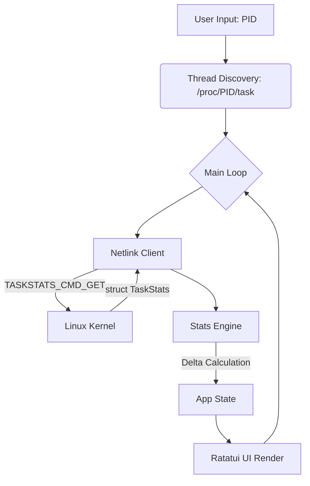
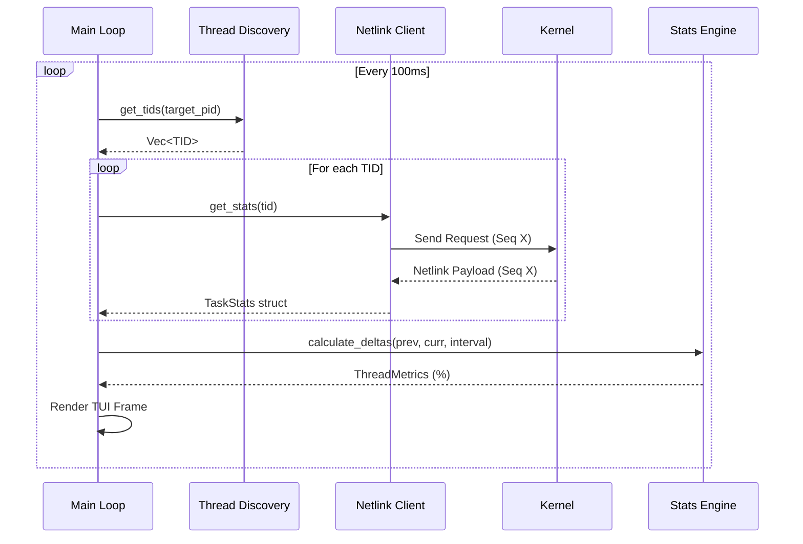

# Architectural Design: tsastat

`tsastat` is a high-resolution Thread State Analysis (TSA) tool. It leverages Linux Kernel Delay Accounting via Generic Netlink to provide microsecond-precision visibility into thread execution and wait states.

## 1. High-Level Architecture

The system is composed of four primary layers:
1.  **Discovery Layer**: Interfaces with `/proc` to identify active threads (TIDs).
2.  **Communication Layer (Netlink)**: Manages raw binary communication with the Linux Kernel.
3.  **Analysis Layer**: Calculates state transition deltas over fixed time intervals.
4.  **Presentation Layer (TUI)**: A terminal-based dashboard for real-time observation.

## 2. Component Breakdown

### 2.1 Protocol Definition (`protocol.rs`)
Defines the binary contract between userspace and the kernel. It uses `#[repr(C)]` to ensure memory alignment matches the Linux ABI exactly. It captures key metrics:
*   `cpu_run_real_total`: Time spent on CPU.
*   `cpu_delay_total`: Time spent waiting for a CPU (Scheduler latency).
*   `blkio_delay_total`: Time spent waiting for Disk I/O.
*   `swapin_delay_total`: Time spent waiting for memory pages.

### 2.2 Netlink Client (`netlink.rs`)
The core engine for kernel communication.
*   **Discovery**: Uses the `GENL_ID_CTRL` controller to resolve the `TASKSTATS` family ID.
*   **Sequence Tracking**: Implements an internal `seq_num` to ensure responses match requests, preventing "ghost packets" from previous polls.
*   **Binary Parsing**: Manages manual TLV (Type-Length-Value) parsing of nested attributes with 4-byte alignment logic.

### 2.3 Stats Engine (`stats.rs`)
Converts raw nanosecond counters into human-readable percentages.
*   **Logic**: `(Current_Stat - Previous_Stat) / Interval_Duration_Nanoseconds`.
*   **Safety**: Uses `saturating_sub` to protect against potential counter anomalies.

### 2.4 TUI Controller (`app.rs` & `ui.rs`)
Uses `ratatui` for the interface. 
*   The `App` struct maintains the "Source of Truth" for the UI, including table selection state and the sorted list of `ThreadEntry` items.
*   `ui.rs` implements a dual-pane layout: a summary table and a raw kernel data inspector.

## 3. Data Flow and Concurrency

`tsastat` operates on a single-threaded synchronous event loop. This ensures consistent timing for delta calculations without the complexity of lock contention.

## 4. Design Decisions & Trade-offs

### 4.1 Zero-Copy Deserialization
Rather than using a heavy serialization framework like Serde for the actual `TaskStats` payload, the project uses `std::ptr::read_unaligned` to cast raw bytes directly into the `TaskStats` struct. 
*   **Pro**: Extremely high performance; matches Kernel memory layout.
*   **Con**: Requires `unsafe` blocks and strict adherence to `repr(C)` padding.

### 4.2 Polling vs. Events
The tool uses a polling interval (default 100ms).
*   **Trade-off**: While eBPF would allow for event-driven updates, Netlink `taskstats` is more portable across different Linux distributions and does not require a Clang/LLVM toolchain to be present on the target system.

### 4.3 Directory vs. Netlink Multicast
Threads are discovered via `/proc` instead of Netlink multicast groups.
*   **Decision**: This allows the tool to target a *specific* PID tree efficiently without being flooded by global system-wide thread exit events.

## 5. Security Requirements

Communication with Netlink sockets (`AF_NETLINK`) using the `NETLINK_GENERIC` family requires:
1.  **Effective UID 0 (root)**: Standard user accounts cannot open the required raw sockets.
2.  **CAP_NET_ADMIN**: Specific capability required for certain Taskstats commands.

## 6. Future Extensibility

The architecture is designed to support:
*   **Memory Profiling**: Extending `TaskStats` struct to include RSS and page fault metrics already provided by the kernel.
*   **Logging**: Adding a background mode to dump TSA metrics to CSV for offline analysis.
*   **Thread Naming**: Resolving TID names from `/proc/[pid]/task/[tid]/comm`.

