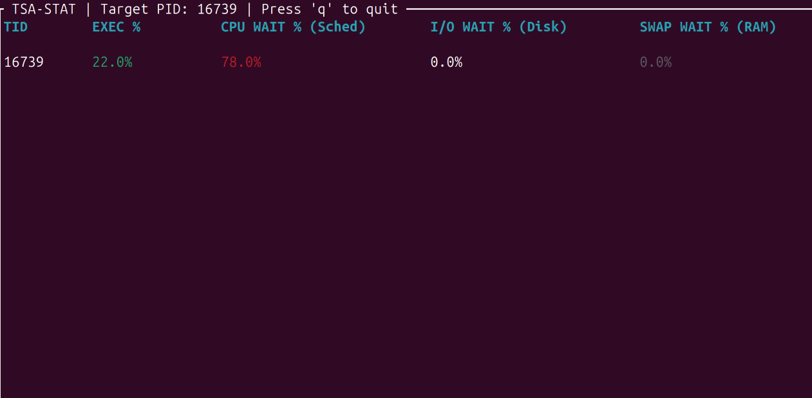

# tsastat (Thread State Analysis)

**A high-resolution Linux thread profiling TUI built in Rust, powered by Kernel Delay Accounting (Taskstats) and raw Netlink sockets.**


## The Problem: The "100% CPU" Lie
Standard tools like `top` or `/proc/[pid]/stat` tell you if a process is using the CPU, but they are terrible at telling you *why* a process is slow when it isn't. 

If a database query takes 5 seconds, was the thread actually executing? Was it waiting in the run-queue because the CPU was saturated? Was it stalled on a page fault? Standard tools lack the granularity to answer these questions without expensive `strace` or `perf` overhead.

## The Solution: Linux Delay Accounting
**`tsastat`** communicates directly with the Linux Kernel Scheduler via **Generic Netlink** to extract microsecond-precision Delay Accounting metrics for a specific Thread ID (TID).

Instead of showing absolute usage, it calculates the **rolling percentage of time** a thread spends in specific states:
*   **EXEC:** Actively executing on the CPU.
*   **CPU WAIT:** Runnable, but waiting for the CPU scheduler (Saturation).
*   **I/O WAIT:** Blocked waiting for synchronous block I/O (Disk).
*   **SWAP WAIT:** Blocked waiting for memory paging.

## Inspiration: The "Missing" Linux Tool

This project was directly inspired by a footnote in **Brendan Gregg's "Systems Performance: Enterprise and the Cloud"** (Chapter 4: Observability Tools). 

Discussing the lack of Thread State Analysis (TSA) tools for Linux, Gregg wrote:
> *"Trivia: since the first edition I'm not aware of anyone solving this... I planned to develop a Linux TSA tool for the talk; however, my talk was rejected... and I have yet to develop the tool."*

`tsastat` is an attempt to answer that call for the Linux ecosystem, leveraging modern Rust and raw Netlink `taskstats` to build the TSA tool that was historically missing.

## Demo



*In this example, the targeted thread is suffering from massive CPU saturation. It spends ~78% of its time just waiting in the run-queue to be scheduled, highlighting a severe "noisy neighbor" or under-provisioning issue.*

## Under the Hood (Architecture & Kernel Quirks)

This tool bypasses high-level wrappers to interface directly with the Linux ABI:
1.  **Dynamic Discovery:** Communicates with the `GENL_ID_CTRL` controller to dynamically resolve the `TASKSTATS` family ID at runtime.
2.  **Binary TLV Parsing:** Manually parses nested Type-Length-Value (TLV) attributes from the Netlink byte stream, enforcing strict 4-byte alignment rules.
3.  **Zero-Cost Deserialization:** Uses `#[repr(C)]` structs and `std::ptr::read_unaligned` to safely cast raw network buffers directly into Rust structures.

### The "Lazy Accounting" Kernel Heuristic
During the development of `tsastat`, profiling revealed a significant shift in how modern Linux kernels (5.15+) handle Delay Accounting for thread groups. 

To save scheduler overhead, the kernel aggressively caches `taskstats` metrics. While it flawlessly reports metrics for individual, highly-active Child Processes/Threads (as seen in the demo), it often relies on "Lazy Evaluation" for dormant threads or entire Process Groups, only flushing the true nanosecond counters to userspace when the thread exits or undergoes a major state transition. 

This finding highlights the modern shift in Linux observability: **Polling-based interfaces (like Netlink `taskstats`) are giving way to Event-Driven architectures (like eBPF).**

## Usage

**Prerequisites:**
Linux Kernel with Task Delay Accounting enabled (`CONFIG_TASK_DELAY_ACCT=y`).
*(Often enabled via boot parameter `delayacct` in GRUB).*

### Build & Run
Because this tool queries the kernel scheduler directly via Netlink, it requires `root` privileges.

```bash
cargo build --release
sudo ./target/release/tsastat <TID>
```

### License
MIT License